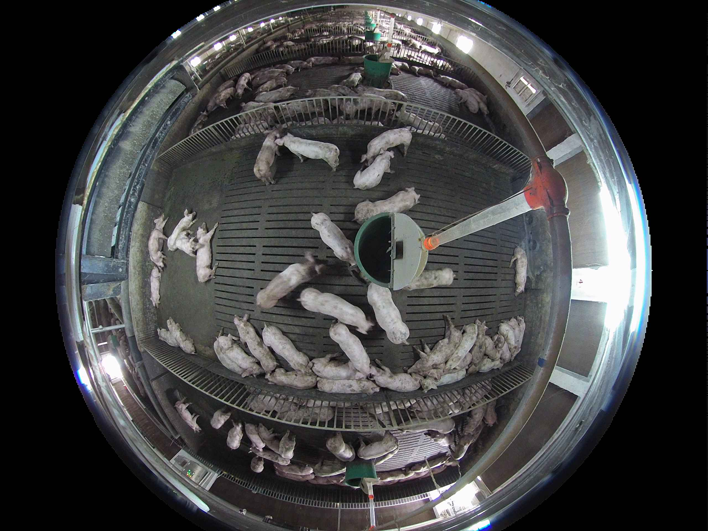
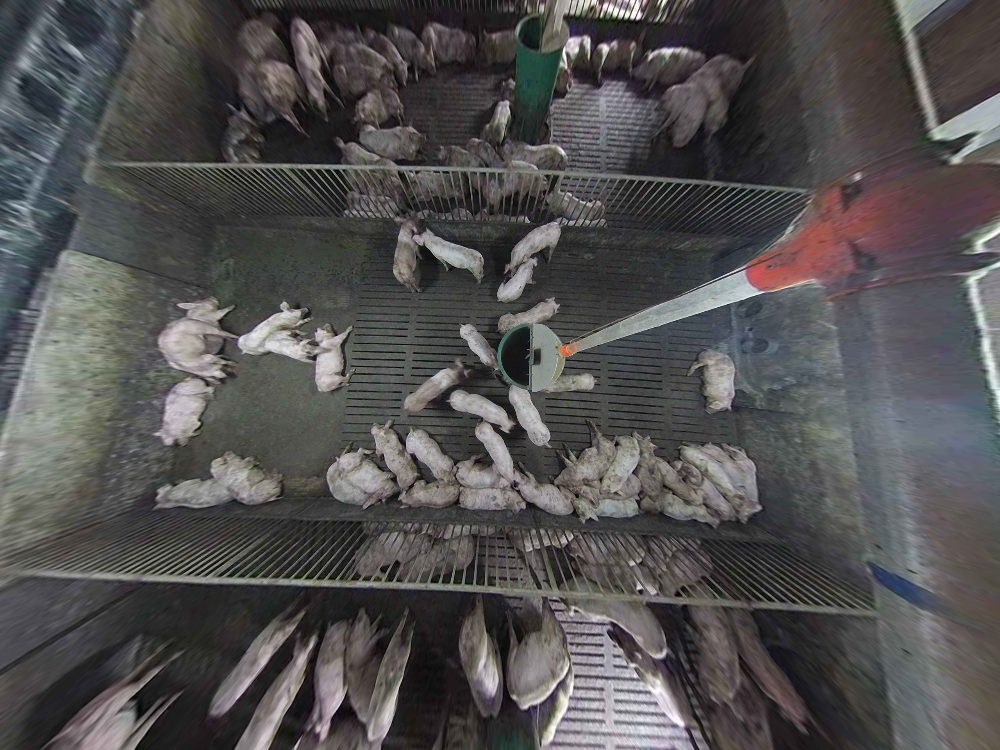
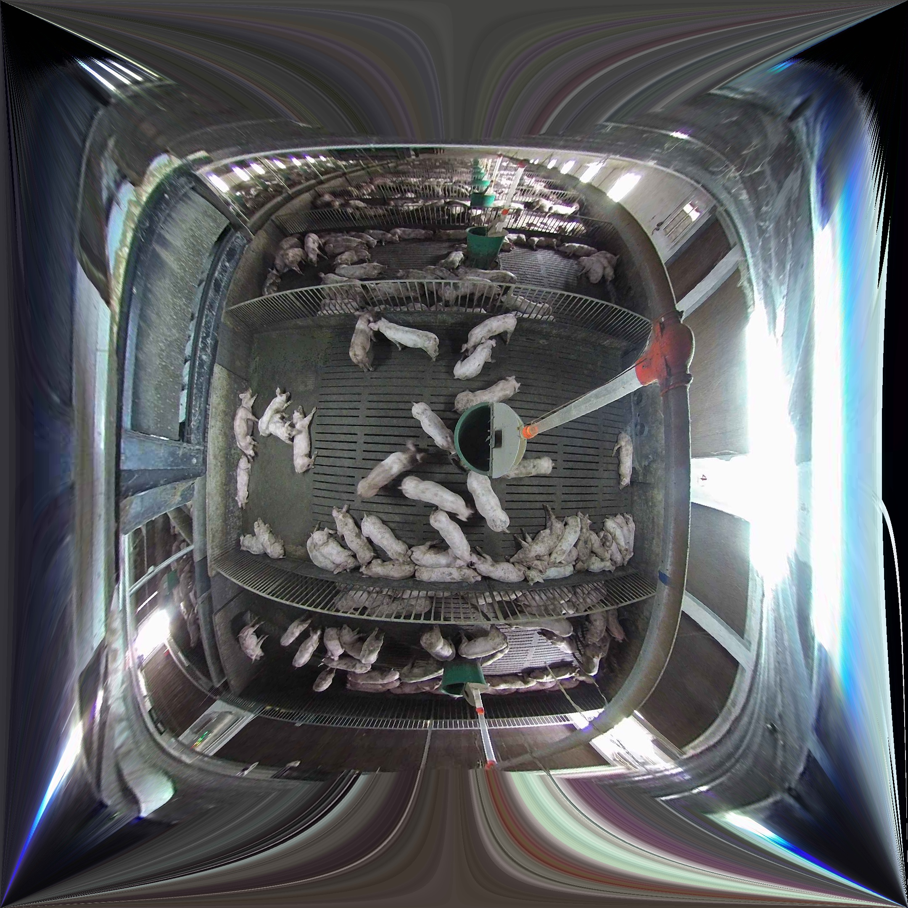

## 鱼眼矫正
常见的鱼眼矫正算法
- 棋盘格矫正法
- 经纬度矫正法

## 鱼眼图示例

## 棋盘格矫正法
利用棋盘格进行标定， 然后计算鱼眼镜头的畸变系数以及内参， opencv中自带有fisheye模块， 可以直接根据棋盘格标定结果，采用`cv2.fisheye.calibrate`计算畸变系数以及内参， 然后使用`cv2.fisheye.initUndistortRectifyMap`函数计算映射矩阵， 最后根据映射矩阵， 使用`cv2.remap`进行矫正。
矫正结果如下：

棋盘格矫正法的效果并不好， 而且边缘效果较差， 拉伸比较严重。
> 参考代码：

## 经纬度矫正法
经纬度矫正法， 可以把鱼眼图想象成半个地球， 然后将地球展开成地图，经纬度矫正法主要是利用几何原理， 对图像进行展开矫正， 基于经纬度矫正法进行改进的矫正的算法也很多， 下面主要介绍的是双径度矫正法， 具体的原理参考论文《基于双经度模型的鱼眼图像畸变矫正方法》。

### 代码复现
根据作者的论文， 采用python对论文进行复现（建议结果论文查看代码）， 发现效果不错， 不过耗时非常严重， 采用最近邻插值方式， 每张图耗时大概在6s左右， 采用双线性插值， 耗时在34s左右。
> 参考代码：02.double_longitude/main.py

### 代码优化
因为代码中进行插值涉及到了两层循环， 而且每层循环，计算量都非常大， 因此想到了几点优化方案。
- 采用矩阵运算代替循环
- 将python代码更改为c
- 多线程
- 采用gpu加速（pycuda）

想到的几种加速方案， 在尝试了第一种结果方案时候， 发现最近邻插值运行速度从6s降到了0.3s， 果断放弃了尝试其他方案的想法，大神们也可以尝试一下其他方案。
> 参考代码：02.double_longitude/main_vector.py

### 插值方式
理论上双线性插值的结果应该优于最近邻插值， 不过双线性插值方式计算量大， 非常耗时， 而且两种不同的插值方式， 结果差异肉眼几乎无法区分， 在代码改成矩阵计算后， 双线性插值方式代码实现起来繁琐， 所以采用了最近邻插值。

矫正效果如下：

